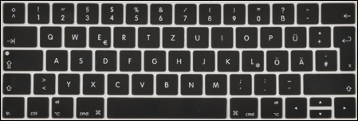
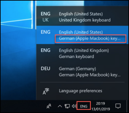

# Windows keyboard layout "German (Apple Macbook)"

This is a MS Windows keyboard layout for Apple Macbook keyboards with German `QWERTZ` layout. Useful when running Windows on a Macbook (vm, bootcamp) or when connecting from a Mac to a remote Windows system via rdp, vnc, etc.

## installation
- Download and extract installer zip archive from the [releases page](https://github.com/christian-korneck/win10-keyboard-macbook-german/releases)
- run `setup.exe` with admin privileges
- reboot
- now you should find a new keyboard `German (Apple Macbook)` in the Windows language settings.

## usage
All keys behave similar on Windows as they the would on macOS, with one exception: Instead of `alt`, use `ctrl` + `alt` in key combinations (for example, to type the `@` symbol, press `ctrl` + `alt` + `L`). Everything else should behave the same as on macOS.

## Troubleshooting
### Microsoft Remote Desktop App for macOS: `[^]` and `[<]` keys are swapped
#### Problem
The ["old" Microsoft Remote Desktop App for macOS](https://itunes.apple.com/de/app/microsoft-remote-desktop-8/id715768417?l=en&mt=12) seems to swap the keys VK_OEM5 (`[^]`) and VK_OEM_102 (`[<]`) when connecting to a remote Windows host.
#### Solution
The ["new" Microsoft Remote Desktop **Beta** App for macOS](http://go.microsoft.com/fwlink/?LinkID=619698&clcid=0x409) doesn't seem to have this issue. I recommend to use it instead.

## edit & build
- open, edit and compile `DeApplMb.klc` with [MS Keyboard Layout Creator](https://www.microsoft.com/en-us/download/details.aspx?id=22339)

